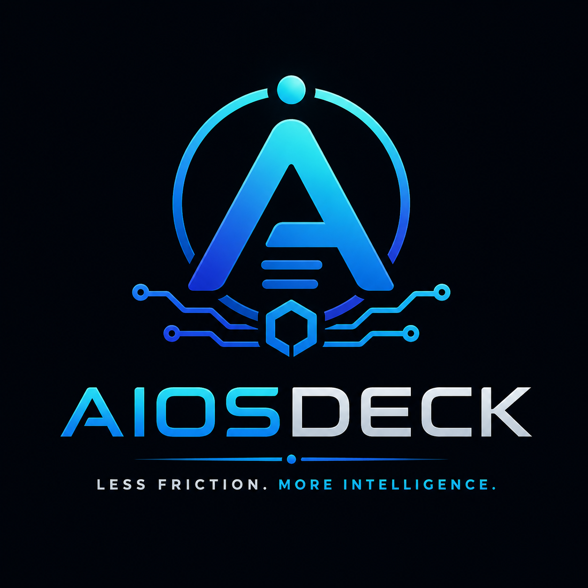

<p align="center">
  
</p>

<h1 align="center">AiosDeck</h1>

<p align="center">
  <i>Less friction. More intelligence.</i>
</p>

<p align="center">
  
  
  
  
  
</p>

AiosDeck is an intelligent orchestration platform that transforms AI-assisted development from isolated conversations into **collaborative software engineering**.

Instead of talking to a single language model, you work with a **coordinated team of specialized AI agents** — each with one responsibility, governed by a kernel that manages context, memory, workflows, and security.

Just as an operating system coordinates CPU, memory, and processes, AiosDeck coordinates **context, planning, implementation, review, and documentation**.

The result is a development environment that remembers your projects, understands your architecture, and continuously assists your workflow.

## Table of Contents

- [Core Idea](#core-idea)
- [Philosophy](#philosophy)
- [Relationship with ProjDesk](#relationship-with-projdesk)
- [Roadmaps](#roadmaps)
- [Architecture](#architecture)
- [How It Works](#how-it-works)
- [Security](#security)
- [Agent Ecosystem](#agent-ecosystem)
- [Skills](#skills)
- [Decisions](#decisions)
- [Getting Started](#getting-started)
- [License](#license)

## Core Idea

Traditional AI tools follow a single conversation loop. The model is the center of everything.

```
Developer
   │
   ▼
LLM
   │
   ▼
Answer
```

AiosDeck introduces an execution layer between you and the model. The language model is no longer the center of the system — it becomes an **execution engine**.

```
Developer
   │
   ▼
AiosDeck
   │
   ├── Planner       (decomposes intent)
   ├── Context       (enriches with project knowledge)
   ├── Memory        (remembers decisions and conventions)
   ├── Scheduler     (orchestrates task queue)
   ├── Agents        (execute with single responsibility)
   ├── Quality Gates (validate every output)
   └── Security      (enforces zero-trust policies)
   │
   ▼
Runtime (OpenCode via ai-jail)
   │
   ▼
LLMs (Ollama / GPT / Gemini / Claude)
```

## Philosophy

AiosDeck is built around **ten principles** that guide every architectural decision.

| Principle | Meaning |
|-----------|---------|
| **Context before Intelligence** | Better context produces better answers. Inject project knowledge before every prompt. |
| **Automation over Prompts** | Detect whenever possible. Never ask what can be discovered. |
| **One Agent. One Responsibility.** | Every agent has exactly one job. Nothing more. |
| **Events over Function Calls** | Communication happens through an event bus, never through direct coupling. |
| **Humans Own the Architecture** | Humans define goals. Agents execute. Architecture decisions are human territory. |
| **Local First. Cloud Optional.** | Everything runs locally by default. Cloud models are an option, never a requirement. |
| **Memory Is Part of the System** | Memory is a first-class citizen, not a shortcut. The system remembers across sessions. |
| **The Runtime Is Replaceable** | OpenCode is one runtime. Not the runtime. The adapter pattern keeps it swappable. |
| **Security Is Architecture, Not a Feature** | Zero-trust, capabilities, and sandboxing from day one. Every agent is untrusted until explicitly authorized. |
| **The ProjDesk Contract** | ProjDesk manages the development environment. AiosDeck manages the intelligence environment. If a feature doesn't help manage the developer's intelligence workspace, it doesn't belong in AiosDeck. |

> **Every abstraction must solve an existing problem. Never an anticipated one.**

The full philosophy is documented in [philosophy.md](philosophy.md).

## Relationship with ProjDesk

ProjDesk prepares your **development workspace**. AiosDeck prepares your **intelligence workspace**. Together they create an autonomous development environment.

```
Developer
   │
   ▼
ProjDesk
   │
   ├── Docker
   ├── VS Code
   └── Workspace
   │
   ▼
AiosDeck
   │
   ├── Context
   ├── Agents
   └── OpenCode
   │
   ▼
LLMs
```

The contract between them is a **project manifest** (`aios/project.yaml`) — a single file that describes how the project should be understood, which Skills to load, which Quality Gates to run, and which agents to enable. ProjDesk can generate it. AiosDeck consumes it. It works with or without ProjDesk.

## Roadmaps

AiosDeck maintains three roadmaps. Only one is active.

### Vision Roadmap — Where We Are Going

The destination. No dates. No versions. Pure direction.

- **AI Operating System** — A coordinated team of specialized AI agents, each with one responsibility
- **Marketplace** — Community-contributed Agents, Skills, Workflows, and Plugins
- **Distributed Agents** — Agents running across machines, coordinated by the Scheduler
- **Cloud Sync** — Shared memory, shared policies, per-team agents (local-first, cloud-optional)
- **IDE Integration** — In-editor agent panels, inline reviews, side-by-side context

### Architecture Roadmap — What We Know Will Exist

All planned phases. Documented, specified, but not all implemented.

| Phase | Status | Components |
|-------|--------|------------|
| v0.1 Foundation | **In progress** | CLI, Configuration, Context Engine, Runtime Adapter, OpenCode + ai-jail, Skills, Logger |
| v0.2 Developer Agent | Specified | Single agent that handles everything |
| v0.3 Memory | Specified | SQLite-backed persistence for conventions, decisions, architecture |
| v0.4 Planner | Specified | Task decomposition, prioritization |
| v0.5 Reviewer | Specified | Architecture critique, convention enforcement |
| v0.6 Quality Pipeline | Specified | Format → Lint → Tests → Security → AI Review → Docs Review |
| v0.7 Workflows | Specified | `/feature`, `/fix`, `/review`, `/refactor`, `/document`, `/release` |
| v0.8 Multi-Agent | Specified | Scheduler with concurrent agents |
| v0.9 Plugins | Specified | Extension points for Runtimes, Agents, Skills, Workflows |
| v1.0 AI OS | Specified | ProjDesk integration, status dashboard |

### Implementation Roadmap — What We Are Building Now

The only roadmap that matters day to day. Everything else is blocked.

| Component | Version | Task |
|-----------|---------|------|
| CLI (`aios`) | v0.1 | Entry point, command parsing, routing |
| Configuration | v0.1 | Detection > manifest > user config > env > defaults |
| Context Engine | v0.1 | Language detection, tool detection, Git/Docker/OpenCode status |
| Runtime Adapter | v0.1 | OpenCode invocation via ai-jail, skill loading, prompt construction |
| Event Bus | v0.1 | In-process pub/sub, topics, audit logging |
| Security (skeleton) | v0.1 | Policy loading, audit logging. Full enforcement in v0.6 |
| Logger | v0.1 | Structured logging, session audit trail |

**Rule**: Every abstraction must solve an existing problem. Never an anticipated one. If a component is not in this table, it has not earned its existence yet.

### Agent Birth Timeline

```
v0.2  Developer    ████████░░░░░░░░░░░░░░░░░░░░░░░░░░░░░░
v0.3  Memory       ░░░░░░░░████████░░░░░░░░░░░░░░░░░░░░░░░
v0.4  Planner      ░░░░░░░░░░░░░░░░████████░░░░░░░░░░░░░░░
v0.5  Reviewer     ░░░░░░░░░░░░░░░░░░░░░░░░████████░░░░░░░
v0.6  Tester       ░░░░░░░░░░░░░░░░░░░░░░░░░░░░░░████████░
v0.6  Documentation░░░░░░░░░░░░░░░░░░░░░░░░░░░░░░░░████████
v0.7  Git          ░░░░░░░░░░░░░░░░░░░░░░░░░░░░░░░░██████░
v0.8  Research     ░░░░░░░░░░░░░░░░░░░░░░░░░░░░░░░░░░░░███
```

## Architecture

```
                         User
                          │
                          ▼
                    AiosDeck CLI (aios)
                          │
                          ▼
                        Kernel
                          │
                  Event Dispatcher
                          │
             ┌────────────┼────────────┐
             ▼            ▼            ▼
         Scheduler     Memory      Context
                          │
                          ▼
                     Task Queue
                          │
                  Security Manager
             ┌────────────┼────────────┐
             │ Policy Engine           │
             │ Capability Manager      │
             │ Secret Manager          │
             │ Prompt Firewall         │
             │ Audit Logger            │
             │ Approval Gates          │
             └────────────┼────────────┘
                          │
                  Quality Pipeline
             ┌────────┬───┴───┬────────┬────────┐
             ▼        ▼       ▼        ▼        ▼
          Format    Lint   Tests  Security  AI Arch
                                              │
                                    Documentation Review
                          │
             ┌────────────┼─────────────┐
             ▼            ▼             ▼
          Planner      Coder      Reviewer
             │            │             │
             │    (loads Skills from    │
             │     OpenCode skill       │
             │     tool on-demand)      │
             │            │             │
             └────────────┼─────────────┘
                          ▼
                   Runtime Adapter
                          │
                 OpenCode (via ai-jail)
                          │
               Ollama / GPT / Gemini / Claude
```

Full architecture is documented in [architecture.md](architecture.md).

## How It Works

### Project Detection

```bash
aios start
```

AiosDeck detects everything automatically:

- Project language (Python, JS/TS, Rust, Shell, Go, ...)
- Dependency manager (uv, pip, npm, cargo, ...)
- Linter (ruff, eslint, clippy, shellcheck, ...)
- Formatter (black, prettier, cargo fmt, shfmt, ...)
- Test runner (pytest, vitest, jest, bats, cargo test, ...)
- Git repository status
- Docker and Docker Compose presence
- OpenCode configuration and available Skills
- ai-jail sandbox configuration

All of this feeds into the **Context Engine**, which enriches every agent prompt with project-specific knowledge. No prompts. No configuration files. Just detection.

### The Project Manifest

Every project can declare an `aios/project.yaml` that defines how the project should be understood:

```yaml
name: my-project
language: python
runtime: opencode
sandbox: ai-jail

quality:
  lint: ruff
  format: black
  tests: pytest

skills:
  - project-dna
  - coding-style

workflows:
  - feature
  - fix
  - review
```

This manifest is the contract between ProjDesk and AiosDeck — and between any project and its AI agents.

### Session Flow

```
aios start
   │
   ├── Detects project characteristics
   ├── Loads project manifest
   ├── Restores memory from previous sessions
   ├── Assembles context (language, tools, conventions, architecture)
   ├── Loads active Skills (project-dna, coding-style)
   ├── Spawns Runtime (OpenCode via ai-jail)
   └── Shows status dashboard
```

```
──────────────────────────────
 ProjDesk
 Workspace Ready
──────────────────────────────
 Docker        Running
 Git           main
 Skills        12 loaded
 Memory        Loaded
 Developer     Ready
 Planner       Offline
 Reviewer      Offline
 Tester        Offline
 Documentation Offline
 OpenCode      Connected
 Runtime       ai-jail
 Status        Healthy
──────────────────────────────
 Welcome back.
```

## Security

Security is not a feature. It is architecture. From the first line of code.

### Zero-Trust Model

Every agent is **untrusted until explicitly authorized**. Instead of giving agents full access, each receives only the **capabilities** required for its job.

```yaml
agents:
  planner:
    filesystem: read
    internet: false
    git: false
    shell: false

  coder:
    filesystem: write
    shell: true
    git: false
    internet: false

  reviewer:
    filesystem: read
    shell: false
    internet: false

  researcher:
    internet: true
    filesystem: read
```

### Security Components

- **Policy Engine** — enforces capability-based access per agent
- **Capability Manager** — assigns and revokes capabilities at runtime
- **Secret Manager** — injects secrets into runtime, never into prompts
- **Prompt Firewall** — removes secrets, blocks injection, limits size before reaching the model
- **Audit Logger** — records every action with timestamps for debugging and trust
- **Approval Gates** — requires human confirmation for destructive operations (push, delete, migrate)

### Deep Defense

AiosDeck delegates sandbox enforcement to **ai-jail** (process isolation, filesystem masks, directory restrictions, secret masking, per-project policies). AiosDeck adds orchestration and authorization on top. Even if an agent has permission to execute code, it remains constrained by ai-jail policies. Defense in depth.

```yaml
runtime:
  command: ai-jail opencode
  # OpenCode is NEVER invoked directly.
  # The runtime adapter always spawns it
  # inside the security sandbox.
```

## Agent Ecosystem

Agents are specialized. One job each. Nothing more.

| Agent | Since | Responsibilities | Cannot |
|-------|-------|-----------------|--------|
| **Developer** | v0.2 | Write code, understand context | (replaced by specialists in v0.8) |
| **Memory** | v0.3 | Store and retrieve knowledge | Execute code, access internet |
| **Planner** | v0.4 | Decompose tasks, prioritize | Write code, touch Git, modify files |
| **Reviewer** | v0.5 | Critique code, architecture, conventions | Write new code |
| **Tester** | v0.6 | Run tests, verify behavior | Write production code |
| **Documentation** | v0.6 | Update docs, ADRs, CHANGELOG | Write application code |
| **Git** | v0.7 | Commits, branches, tags | Write code (only agent with git permission) |
| **Research** | v0.8 | Search docs, APIs, dependencies | Modify files |

Each agent is documented in detail under [agents/](agents/). Every agent has its own ADR (Architecture Decision Record) with `In → Process → Out` specification, events emitted, events consumed, and a timeline of when each capability is introduced.

## Skills

Agents learn by loading Skills — small knowledge fragments that teach them how to work with specific technologies, patterns, or conventions. AiosDeck uses OpenCode's native Skill system rather than reinventing it.

### Core Skills (v0.1)

| Skill | Description |
|-------|-------------|
| `project-dna` | Project identity, vision, architecture, patterns, review checklist, common mistakes |
| `coding-style` | Code conventions, naming, organization, patterns to encourage and avoid |

### Future Skills

`docker-lifecycle`, `git-workflow`, `architecture-principles`, `agent-design`, `review-checklist`, `documentation-style`, `bash-style`, `semantic-command-tree`, `modular-architecture`, `project-philosophy`, `event-bus`, `runtime-opencode`, `ai-jail`.

Skills are born when they solve an **existing** problem — never before.

## Decisions

Architecture Decision Records explain **why** each foundational choice was made — not just what was chosen. These preserve context for future maintainers.

| ADR | Decision |
|-----|----------|
| [ADR-0001](decisions/ADR-0001-open-code-as-runtime.md) | OpenCode as primary runtime |
| [ADR-0002](decisions/ADR-0002-ai-jail-as-sandbox.md) | ai-jail as security sandbox |
| [ADR-0003](decisions/ADR-0003-event-bus-architecture.md) | Event-driven architecture with in-process bus |
| [ADR-0004](decisions/ADR-0004-skills-over-monolithic-agents.md) | Skills over monolithic agent prompts |
| [ADR-0005](decisions/ADR-0005-sqlite-for-memory.md) | SQLite for memory persistence |

## Getting Started

AiosDeck is in pre-alpha. The following will become available as versions ship.

```bash
# Install (future)
git clone <repository-url> ~/.config/aiosdeck
~/.config/aiosdeck/install.sh

# Start a session
aios start

# Run a workflow
aios /feature add-user-authentication

# Show status
aios status
```

### Requirements

- **Linux** (primary platform)
- **Python 3.12+**
- **OpenCode** (runtime for agent execution)
- **ai-jail** (security sandbox)
- **ProjDesk** (workspace manager, optional but recommended)

## License

[MIT](../LICENSE) © Gabriel Pablo Garcia

---

**Read next:** [Vision](vision.md) → [Philosophy](philosophy.md) → [Architecture](architecture.md) → [Decisions](decisions/)
